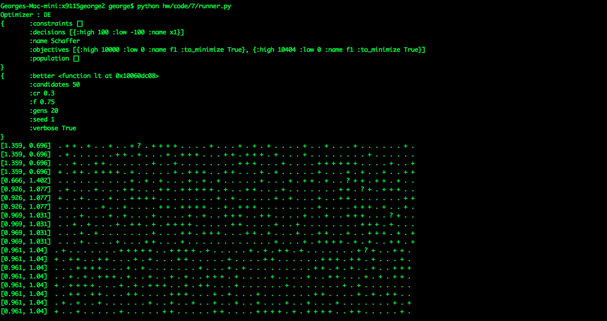
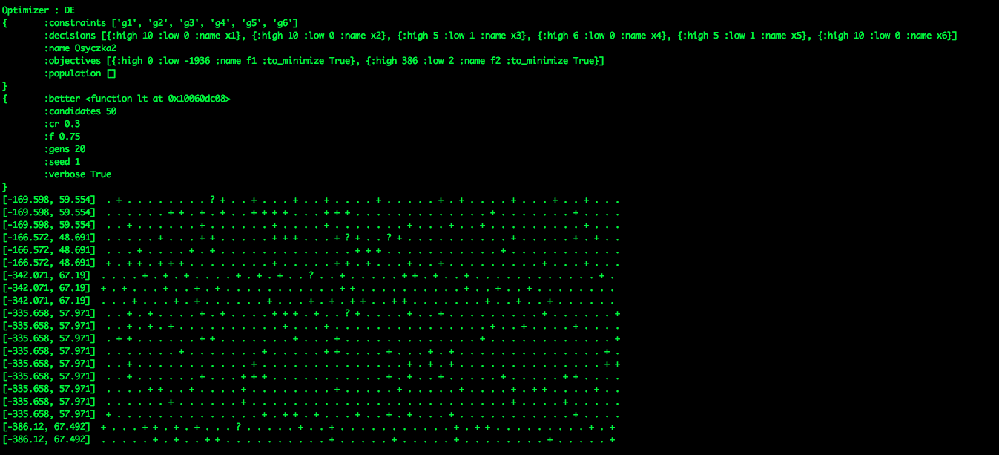
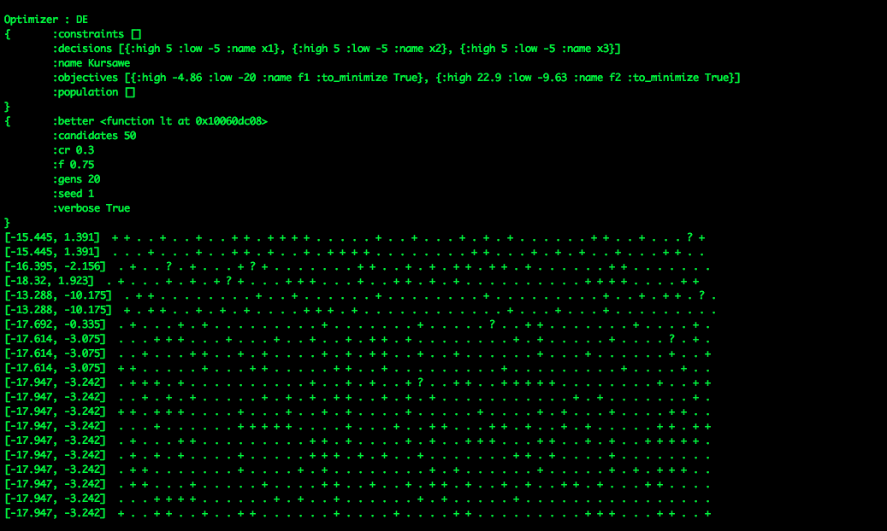
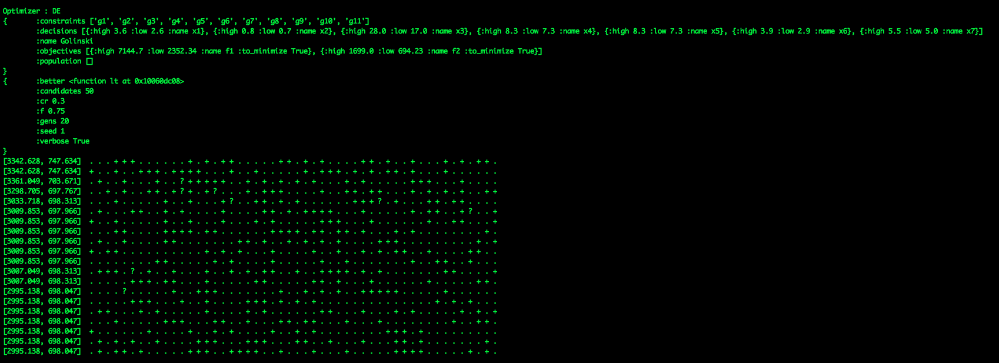

# Coding HW 7

## Algorithms
* Differential Evolution

## Legend
* **?** represents a mutant with a better global solution.
* **+** represents a mutant with a better solution than its parent.
* **.** represents a mutation that yields a mutant worse than its parent.

## Outputs
### Schaffer on DE

### Osyczka2 on DE

### Kursawe on DE

### Golinski on DE

